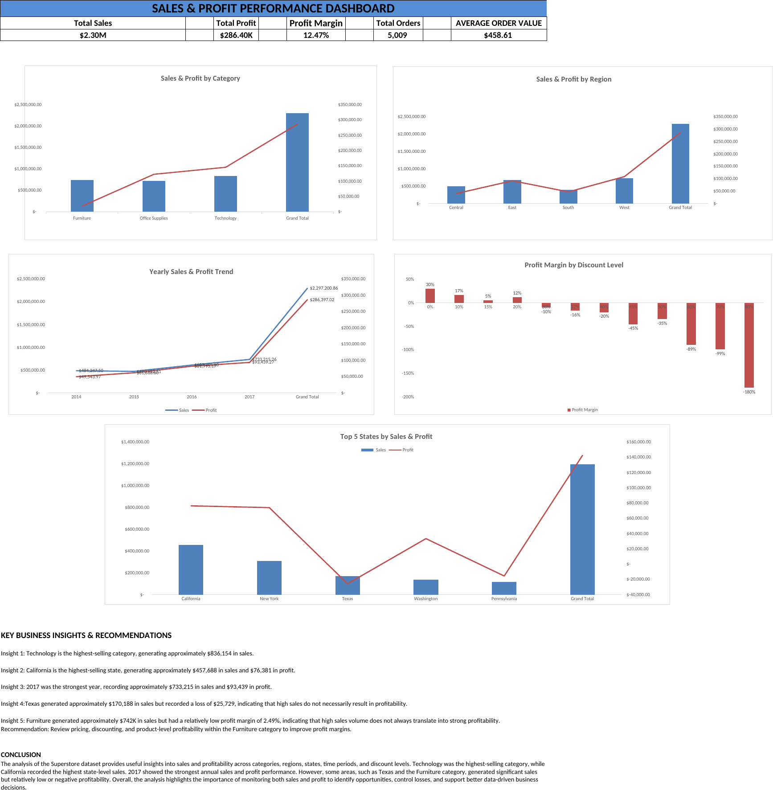

# Sales & Profit Performance Dashboard

## Project Overview
This project analyses retail sales and profitability using Microsoft Excel. The dashboard provides insights into sales performance, profit margins, product categories, regions, discounts, and customer segments.

## Dashboard Preview

## Tools Used
- Microsoft Excel
- PivotTables and PivotCharts
- Excel charts and KPI cards

## Key Performance Indicators
| KPI | Result |
|---|---:|
| Total Sales | $2,297,200.86 |
| Total Profit | $286,397.02 |
| Profit Margin | 12.47% |
| Total Orders | 5,009 |
| Average Order Value | $458.61 |
| Total Quantity | 37,873 |
| Average Discount | 15.62% |

## Analysis Performed
- Category and subcategory performance
- Regional and state-level sales analysis
- Product profitability
- Discount impact on profit
- Customer segment and shipping analysis
- Yearly and monthly sales trends

## Key Findings
- Technology had a profit margin of 17.40%.
- Office Supplies had a profit margin of 17.04%.
- Furniture had a lower profit margin of 2.49%.
- The overall profit margin was 12.47%.

## Project Files
- Excel workbook: Dashboard and analysis
- PDF portfolio: Project presentation and results
- PowerPoint: Project presentation

## Author
Manasa A

Aspiring Data Analyst | Excel | Power BI | SQL | Python

[LinkedIn](https://www.linkedin.com/in/manasaa8818)
